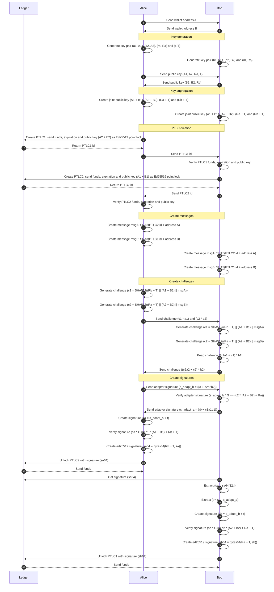

Atomic Swaps using PTLCs
===========================

This demonstrates a single-chain atomic swap using PTLCs on the Zenon Network.

The work presented is based on the [Adaptor Signatures and Atomic Swaps from Scriptless Scripts](https://github.com/BlockstreamResearch/scriptless-scripts/blob/master/md/atomic-swap.md) and should be studied before continuing.

## Installation

The instructions below are for setting up a **devnet** with the **PTLC** support.

Follow the instructions based on the OS you're using:

- [Windows 10+](../setup-devnet-win10-x64.md)
- [Ubuntu 22.04+](../setup-devnet-linux-x64.md)

## Setup

Create a clone of the **main** branch of the [kinggorrin/znn_ptlc_use_cases_go repository](https://github.com/kinggorrin/znn_ptlc_use_cases_go.git).

```
git clone https://github.com/kinggorrin/znn_ptlc_use_cases_go.git
```

Change directory to the **znn_ptlc_use_cases_go** directory.

```
cd znn_ptlc_use_cases_go
```

## Run application

Before running the application make sure a local node is running with the generated **devnet** configuration and connect the explorer to the local node. This will give a good overview of all the onchain transactions being made by the application.

Execute the following command to start the atomic swap.

```
go run .\app\main.go
```

## Sequence diagram

The following sequence diagram shows all steps that are executed.

